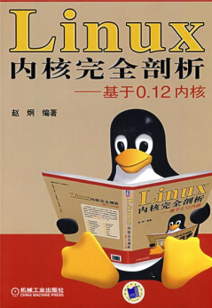

# linux-0.12

这个代码仓库用于记录重温《Linux内核完全剖析》的全过程，尝试以一种全新的方式做读书笔记。

## 章节笔记

[第1章-概述](chapter1/note.md)

## 实验环境搭建

Baby linux！！！看到这张欢迎图片和文字的时候，我都要泪目了

### 编译调试流程

要编译修改后的linux-0.12系统，比如在汇编程序里加上bochs的魔术断点(xchg bx, bx)，有两种方案可以选择

**方案一：在linux-0.12环境下编译**
1. 在ubuntu系统里挂载rootimage-0.12硬盘映像文件（参考17.3章节）
2. 修改代码
3. 用赵炯老师提供的bootimage-0.12-hd（第一次运行）或者我们修改后的引导启动映像文件（编译后生成的）运行0.12系统（参考17.2.3）
4. 在/usr/src/linux目录下执行make命令，编译生成Image文件
5. 参考17.8章节的命令把Image文件写入/dev/fd0，也就是修改bootimage-0.12-hd
6. 重新启动bochs就能看到修改后的效果

**方案二：在现代linux系统下编译**
