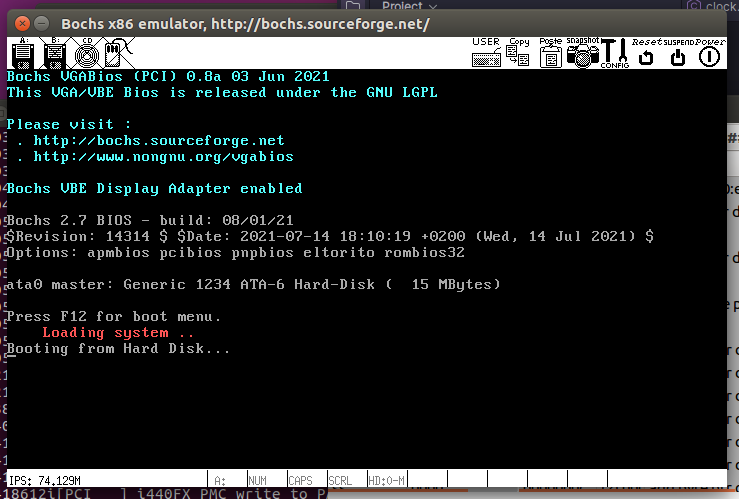

### 让boot.s在bochs上跑起来

#### 方案一
```shell
as86 -0 -a -o boot.o boot.s
ld86 -0 -s -o boot boot.o
bximage -q -hd=16 -func=create -sectsize=512 -imgmode=flat hd.img
dd bs=32 if=boot of=hd.img skip=1 conv=notrunc
```
1. as86命令生成的目标文件不是纯二进制文件，应该是包含了后续链接要用的信息，所以生成目标文件的大小不是512字节的。
2. 通过ld86链接后生成的boot文件也不是512B长度，是因为文件最开始的部分还有32B的MINIX可执行文件的头结构。
3. 所以最后在生成硬盘映像文件的时候，要跳过前面的32B，只拷贝后面的512B部分


#### 方案二

as86可以用```-b```选项生成纯二进制文件（不带MINIX头结构），用这个纯二进制程序就可以引导启动机器。
```shell
as86 -0 -b boot.o boot.s
bximage -q -hd=16 -func=create -sectsize=512 -imgmode=flat hd.img
dd bs=512 if=boot.o of=hd.img seek=0 count=1 conv=notrunc
```

跑起来的截图如下：



### 内联汇编
书里用的内联汇编的示例代码
```c
#define get_seg_byte(seg, addr)
({
register char __res;
__asm__("push %%fs;
        "mov %%ax, %%fs;"
        "movb %%fs:%2, %%al;"
        "pop %%fs"
        :"=a"(__res)
        :"0"(seg), "m"(*(addr)));
__res;})
```
* ```m```表示取变量的内存地址，在这个例子里，等效于&(*addr)
